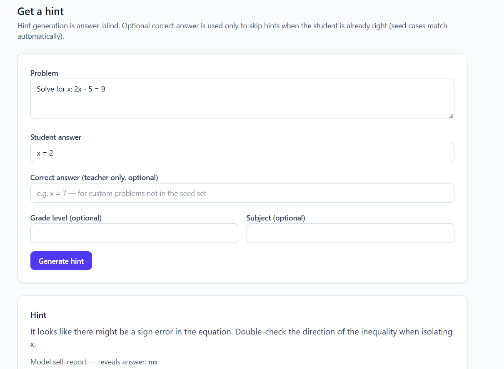
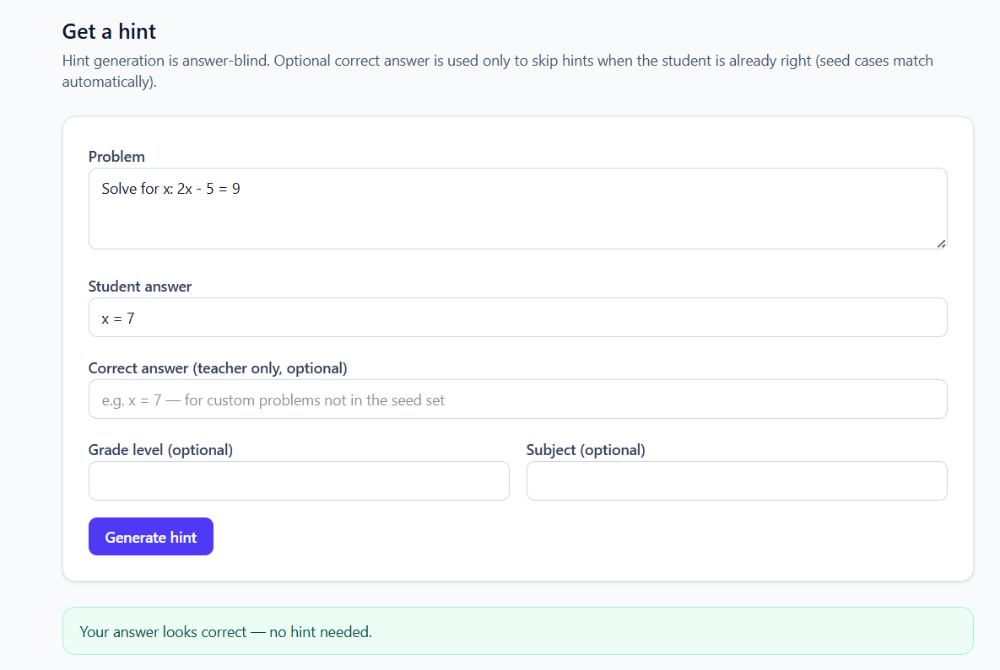

# NudgeMath

NudgeMath is a math-hint generator that nudges students toward the correct answer without revealing it, paired with an evaluation harness that scores hint quality against pedagogical rubrics. The project is built contract-first: core data shapes are defined in Python and propagated through typed boundaries to the API and frontend.

**Architecture (contract-first story for reviewers):** [docs/ARCHITECTURE.md](docs/ARCHITECTURE.md)

**First live eval (portfolio artifact):** [docs/FIRST_EVAL.md](docs/FIRST_EVAL.md) — offline llama3.2 run: self-report unreliability confirmed, judge parse-failure prediction overturned, neutral mistral judge shows self-judging compresses scores.

### Hint view (live)

Wrong student answer — hint generated (answer-blind LLM; seed case `Solve for x: 2x - 5 = 9`):



Correct student answer — no hint; gating only (matches seed case or optional teacher `correctAnswer`):



## Quick Start

```powershell
# 1. Create and activate the virtual environment
python -m venv .venv
.\.venv\Scripts\Activate.ps1
pip install -r requirements.txt

# 2. Pull a local model (no API key required)
ollama pull llama3.2

# 3. Terminal 1 — start the backend
uvicorn hint_engine.api.app:app --reload

# 4. Terminal 2 — start the frontend
cd frontend
npm install    # first time only
npm run dev
```

Open **http://localhost:5173**.

To use Anthropic instead of Ollama, set these before step 3:

```powershell
$env:LLM_DEFAULT_PROVIDER="anthropic"
$env:ANTHROPIC_API_KEY="your-key"
```

## Architecture & stack rationale

| Layer | Choice | Why |
|-------|--------|-----|
| Hint logic | **Python** | Rich LLM ecosystem, easy dataclass contracts, natural home for eval scripts. |
| API boundary | **Strawberry GraphQL + FastAPI** | Schema-first types that mirror Python models; FastAPI gives async, OpenAPI, and easy local dev. |
| Frontend | **Vite + React + TypeScript + Tailwind + Apollo** | Typed components and GraphQL client codegen keep the UI aligned with the same contracts end to end. |

The through-line is a **typed, contract-first stack**: Python dataclasses → GraphQL SDL → codegen → TypeScript client — shape drift is caught at build time, and the answer-blind boundary reaches the browser by construction on the generation path.

## Evaluation

Evaluation has two layers: **deterministic gates** (must-pass, fast, reproducible, CI-blocking) and **LLM-judge scoring** (qualitative rubric, non-deterministic — run with `--judge`).

**Important boundary:** `generate_hint()` never sees the correct answer. The judge (`judge_hint()`) receives `EvalCase.correct_answer` — that is intentional so it can score against truth.

### Deterministic gates (`hint_engine/evaluation.py`)

- **does_not_reveal_answer** — normalized correct-answer value must not appear in hint text; numeric answers also checked via word-boundary regex (documented false positives: e.g. "step 7"); fraction literals checked when applicable
- **reveals_answer_flag** — hint must not self-report `reveals_answer=True`
- **non_empty** — hint text is non-empty after strip
- **within_max_length** — hint length ≤ 600 characters
- **no_banned_phrases** — no "the answer is" / "the correct answer" / "the solution is"

### LLM-judge rubric (`hint_engine/judge.py`)

- **addresses_specific_error** *(must-pass)* — targets the student's actual mistake, not generic advice
- **no_semantic_answer_leak** *(must-pass)* — no paraphrased answer leakage (e.g. "you'll end up with seven")
- **appropriate_for_level** *(advisory)* — tone and vocabulary fit the problem level
- **guides_without_solving** *(advisory)* — points at the next step without working through to the result

Judge `passed` requires both must-pass items; `score` is the fraction of all four rubric items passed.

## LLM generation

Generation and judge use a provider-agnostic **`LLMClient` Protocol** (`hint_engine/llm_client.py`) with an **`OpenAICompatibleClient`** implementation (`openai==2.43.0`). Model and provider are **config**, not hardcoded — resolved from environment variables via `hint_engine/config.py`.

### Offline by default (Ollama)

```powershell
ollama pull llama3.2
# No API key required — defaults to http://localhost:11434/v1
python -m hint_engine.run_eval
python -m hint_engine.model_comparison --models llama3.2,sonnet-4.6 --judge
```

### Environment variables

| Variable | Purpose | Default |
|----------|---------|---------|
| `LLM_DEFAULT_PROVIDER` | `ollama` or `anthropic` | `ollama` |
| `LLM_GEN_NAME` / `LLM_GEN_MODEL` / `LLM_GEN_BASE_URL` / `LLM_GEN_PROVIDER` | Generation endpoint | Ollama `llama3.2` |
| `LLM_GEN_API_KEY_ENV` | Env var name holding API key (if needed) | none for Ollama |
| `LLM_JUDGE_*` | Judge endpoint (defaults to gen config when unset) | same as gen |

**Anthropic example:**

```powershell
$env:LLM_DEFAULT_PROVIDER="anthropic"
$env:ANTHROPIC_API_KEY="your-key"
$env:LLM_GEN_MODEL="claude-sonnet-4-6"
```

Generation and judge default to the **same model** but can diverge via separate `LLM_GEN_*` and `LLM_JUDGE_*` settings.

`generate_hint()` still sees only `HintRequest` — answer-blind boundary unchanged. Provider/model appear in `Hint.meta` and `JudgeResult.meta` (`name`, `model`, `provider`).

## Running the eval

```powershell
$env:ANTHROPIC_API_KEY="your-key-here"
python -m hint_engine.run_eval          # deterministic only (fast, free)
python -m hint_engine.run_eval --judge  # + LLM-judge scoring per case
```

Prints a one-line PASS/FAIL summary per seed case (with judge score when `--judge`), plus deterministic and overall tallies. CI tests mock all API calls; these commands hit the real LLM when configured.

### Cross-model comparison

```powershell
python -m hint_engine.model_comparison --models llama3.2,sonnet-4.6 --judge
```

Produces a cases × models table (deterministic pass / judge score per cell) plus per-model aggregate tallies including **judge_ok** and **parse_fail** rates. With `--judge`, the runner pins a neutral external judge (`sonnet-4.6` by default) so rubric scores are comparable across generation models; override via `LLM_JUDGE_*`. Cells where generation and judge share the same model are marked `*` (self-judged — not comparable). `EvalReport` is unchanged — comparison is an aggregation layer on top.

## GraphQL API

Stack: **Strawberry GraphQL 0.319.0 + FastAPI 0.138.0 + Uvicorn 0.49.0** (`hint_engine/api/`).

```powershell
$env:ANTHROPIC_API_KEY="your-key-here"
uvicorn hint_engine.api.app:app --reload
```

GraphiQL at `http://127.0.0.1:8000/graphql`. CORS allows `http://localhost:5173` (Vite default).

### Answer gating (before the LLM)

Hints appear **only when the student answer is wrong**. The API compares the student submission to a known correct answer **before** calling `generate_hint()` — the LLM never receives `correctAnswer`.

- **Seed problems** — correct answer resolved automatically when the problem text matches a seed eval case.
- **Custom problems** — optional **Correct answer (teacher only)** on the Hint form, or `correctAnswer` on `HintRequestInput`.
- **Equivalent forms** accepted: `7`, `=7`, `x = 7` when the answer is `x = 7`.
- **Rejected as wrong:** conflicting multi-value input such as `=2 =3`.

When the answer matches, the response has `answerCorrect: true` and empty `hintText` — no LLM call.

### Answer confidentiality (two surfaces)

**Generation is answer-blind by construction (schema-enforced, tested).** `HintType` has no `correctAnswer` field — the model never sees the known answer. `HintRequestInput` may include optional `correctAnswer` for **teacher-side gating only**; it is not passed to `generate_hint()`. A CI introspection test fails if `correctAnswer` appears on generation **response** types.

**The eval/admin surface is answer-aware by design and is not access-controlled in this demo.** The `hints` query returns `EvalCaseType.correctAnswer` for all callers; `evaluateCase` runs against seed cases that include the known answer server-side. Anyone with the endpoint can query `hints { correctAnswer }`. That is a deliberate acceptance for a portfolio demo — not a silent gap. In production, the student-facing generation API and the eval/admin API would be separated behind auth.

`EvalReportType` mirrors `EvalReport.to_dict()` field-for-field at the top level (`hintText`, `revealsAnswer`, and `meta` are report-level mirrors of the generated hint, not a nested `hint` object). Typed `HintMetaType` expands the JSON `meta` dict for codegen. Source of truth for the envelope shape is **`EvalReport.to_dict()`** in Python; GraphQL is derived from it.

| Operation | Purpose |
|-----------|---------|
| `generateHint(request)` | Student-facing hint generation — answer-blind |
| `evaluateCase(caseId, withJudge?)` | Eval harness — runs generation + gates (+ optional judge) |
| `hints` | Eval/admin — lists seed cases including `correctAnswer` |

Example:

```graphql
mutation {
  generateHint(request: {
    problem: "Solve for x: 2x - 5 = 9"
    studentAnswer: "x = 2"
    gradeLevel: "8"
  }) {
    hintText
    revealsAnswer
    meta { model latencyMs }
  }
}
```

## Frontend

Stack: **Vite 8.0.12 + React 19.2.6 + TypeScript 6.0 + Tailwind CSS 4.3 + Apollo Client 4.2.3 + GraphQL Code Generator 7.1.3** (`frontend/`).

Types flow **schema → SDL → codegen → client** — no hand-written interfaces mirroring the server. Codegen reads the committed `schema.graphql` at the repo root (not the live endpoint), so the repo builds on clone without the server running or an API key.

**Re-export SDL when the Python schema changes:**

```powershell
python -m hint_engine.api.export_schema | Out-File -Encoding utf8 schema.graphql
cd frontend ; npm run codegen
```

### Run locally (two terminals)

With the venv activated (`.\.venv\Scripts\Activate.ps1`):

```powershell
# Terminal 1 — from repo root
uvicorn hint_engine.api.app:app --reload

# Terminal 2 — frontend (venv not required)
cd frontend
npm install    # first time only
npm run dev
```

Open **http://localhost:5173**. The frontend talks to **http://localhost:8000/graphql**.

For live hints, run Ollama and pull the default model first:

```powershell
ollama pull llama3.2
```

**Try it:** problem `Solve for x: 2x - 5 = 9`, student answer `x = 2` → hint; `x = 7` → “Your answer looks correct — no hint needed.”

### Views

| View | GraphQL | Boundary |
|------|---------|----------|
| **Hint** (student) | `generateHint` only | LLM answer-blind; optional `correctAnswer` on input gates hints only |
| **Eval** (admin/portfolio) | `hints` + `evaluateCase` | Answer-aware — shows seed cases, full `EvalReportType` report card |

The eval report card uses one `CheckResultRow` component for both deterministic checks and judge rubric items (uniform `{ name, passed, detail }` shape). Pass/fail is color-coded; advisory signals (`flagDisagreement`, `modelAnswerDisagreement`) are visible on the eval view.

```powershell
cd frontend ; npm test    # Vitest + React Testing Library, mocked Apollo
```

## CI

GitHub Actions workflow (`.github/workflows/ci.yml`) runs on every push and PR — **fully offline**, no `ANTHROPIC_API_KEY`. Generation and judge are mocked in tests; the **deterministic gate** (pytest), not the LLM-judge, blocks the build.

| Job | What it guards |
|-----|----------------|
| **Python tests** | Deterministic gates, answer-blind introspection, envelope agreement, mocked API |
| **SDL drift check** | Committed `schema.graphql` matches `python -m hint_engine.api.export_schema` |
| **Frontend** | Codegen output committed (`git diff src/generated/`), then `npm run build` + `npm test` |

Jobs run **in parallel** so the Actions tab shows three named checks — easy for a portfolio reviewer to see which layer broke.

Re-export SDL when the Python schema changes:

```powershell
python -c "from pathlib import Path; from strawberry.printer import print_schema; from hint_engine.api.schema import schema; Path('schema.graphql').write_text(print_schema(schema) + '\n', encoding='utf-8')"
cd frontend ; npm run codegen
```

On Linux/macOS: `python -m hint_engine.api.export_schema > schema.graphql`. Avoid PowerShell `Out-File -Encoding utf8` — it can write a BOM that breaks `diff` on Linux CI.

## Setup

Use a project virtual environment so Python deps stay isolated from system Python (CI always does a clean `pip install` on a fresh runner; locally, a venv is the equivalent).

```powershell
python -m venv .venv
.\.venv\Scripts\Activate.ps1   # prompt should show (.venv)
pip install -r requirements.txt
pytest -q
```

**Verify you're in the venv** before installing or running:

```powershell
$env:VIRTUAL_ENV                    # should print ...\NudgeMath\.venv
(Get-Command python).Source        # should point inside .venv\Scripts\
```

If `Activate.ps1` fails with an execution-policy error: `Set-ExecutionPolicy -Scope CurrentUser RemoteSigned` once, then re-run activate.

**Python version:** 3.11+ (developed on 3.11.9).

**Frontend** (`frontend/`) uses its own `node_modules` from `npm install` — Node's isolated deps, separate from the Python venv.

## Project layout

```
hint_engine/
  ...
  api/
    schema.py
    app.py
    export_schema.py   # SDL export for frontend codegen
schema.graphql         # committed SDL (codegen source of truth)
frontend/
  src/
    generated/         # GraphQL Code Generator output (committed)
    components/
    graphql/operations.graphql
tests/                 # Python tests
```
