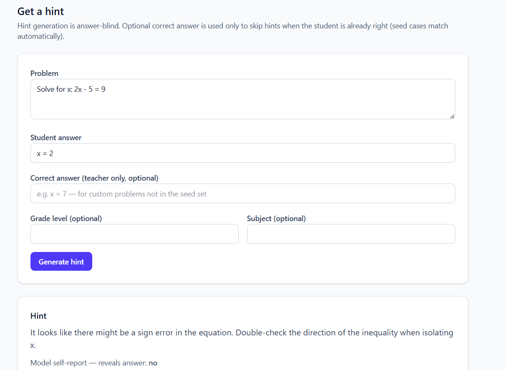
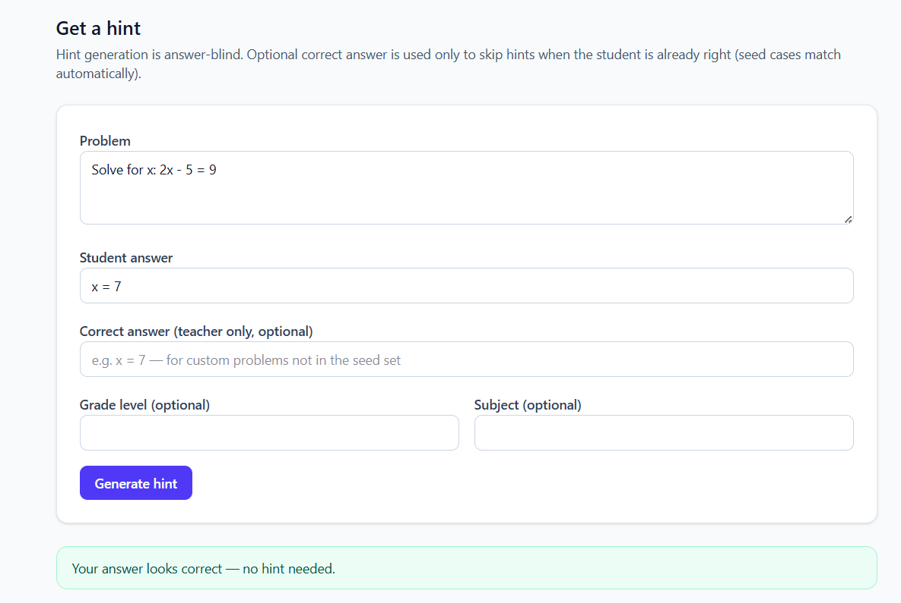

# NudgeMath

NudgeMath is a math-hint generator that nudges students toward the correct answer without revealing it, paired with an evaluation harness that scores hint quality against pedagogical rubrics. The project is built contract-first: core data shapes are defined in Python and propagated through typed boundaries to the API and frontend.

**Architecture (contract-first story for reviewers):** [docs/ARCHITECTURE.md](docs/ARCHITECTURE.md)

**First live eval (portfolio artifact):** [docs/FIRST_EVAL.md](docs/FIRST_EVAL.md) — offline llama3.2 run: self-report unreliability confirmed, judge parse-failure prediction overturned, neutral mistral judge shows self-judging compresses scores.

### Hint view (live)

Wrong student answer — hint generated (answer-blind LLM; seed case `Solve for x: 2x - 5 = 9`):



Correct student answer — no hint; gating only (matches seed case or optional teacher `correctAnswer`):



## Quick Start

```powershell
# 1. Create and activate the virtual environment
python -m venv .venv
.\.venv\Scripts\Activate.ps1
pip install -r requirements.txt

# 2. Pull a local model (no API key required)
ollama pull llama3.2

# 3. Terminal 1 — start the backend
uvicorn hint_engine.api.app:app --reload

# 4. Terminal 2 — start the frontend
cd frontend
npm install    # first time only
npm run dev
```

Open **http://localhost:5173**.

To use Anthropic instead of Ollama, set these before step 3:

```powershell
$env:LLM_DEFAULT_PROVIDER="anthropic"
$env:ANTHROPIC_API_KEY="your-key"
```

## Architecture & stack rationale

| Layer | Choice | Why |
|-------|--------|-----|
| Hint logic | **Python** | Rich LLM ecosystem, easy dataclass contracts, natural home for eval scripts. |
| API boundary | **Strawberry GraphQL + FastAPI** | Schema-first types that mirror Python models; FastAPI gives async, OpenAPI, and easy local dev. |
| Frontend | **Vite + React + TypeScript + Tailwind + Apollo** | Typed components and GraphQL client codegen keep the UI aligned with the same contracts end to end. |

The through-line is a **typed, contract-first stack**: Python dataclasses → GraphQL SDL → codegen → TypeScript client — shape drift is caught at build time, and the answer-blind boundary reaches the browser by construction on the generation path.

## Evaluation

Evaluation has two layers: **deterministic gates** (must-pass, fast, reproducible, CI-blocking) and **LLM-judge scoring** (qualitative rubric, non-deterministic — run with `--judge`).

**Important boundary:** `generate_hint()` never sees the correct answer. The judge (`judge_hint()`) receives `EvalCase.correct_answer` — that is intentional so it can score against truth.

### Deterministic gates (`hint_engine/evaluation.py`)

- **does_not_reveal_answer** — normalized correct-answer value must not appear in hint text; pure-digit answers use word-boundary matching and ignore positional phrases (so "step 7" is **not** flagged when the answer is 7), while tiny numbers 1–5 fall back to substring; fraction literals checked when applicable. Semantic paraphrases stay out of scope (the judge covers them). A case can opt out of a specific gate via `expectations["skip_checks"]`.
- **reveals_answer_flag** — hint must not self-report `reveals_answer=True`
- **non_empty** — hint text is non-empty after strip
- **within_max_length** — hint length ≤ 600 characters
- **no_banned_phrases** — no "the answer is" / "the correct answer" / "the solution is"

### LLM-judge rubric (`hint_engine/judge.py`)

- **addresses_specific_error** *(must-pass)* — targets the student's actual mistake, not generic advice
- **no_semantic_answer_leak** *(must-pass)* — no paraphrased answer leakage (e.g. "you'll end up with seven")
- **appropriate_for_level** *(advisory)* — tone and vocabulary fit the problem level
- **guides_without_solving** *(advisory)* — points at the next step without working through to the result

Judge `passed` requires both must-pass items; `score` is the fraction of all four rubric items passed.

## LLM generation

Generation and judge use a provider-agnostic **`LLMClient` Protocol** (`hint_engine/llm_client.py`) with an **`OpenAICompatibleClient`** implementation (`openai==2.43.0`). Model and provider are **config**, not hardcoded — resolved from environment variables via `hint_engine/config.py`.

### Offline by default (Ollama)

```powershell
ollama pull llama3.2
# No API key required — defaults to http://localhost:11434/v1
python -m hint_engine.run_eval
python -m hint_engine.model_comparison --models llama3.2,sonnet-4.6 --judge
```

### Environment variables

| Variable | Purpose | Default |
|----------|---------|---------|
| `LLM_DEFAULT_PROVIDER` | `ollama` or `anthropic` | `ollama` |
| `LLM_GEN_NAME` / `LLM_GEN_MODEL` / `LLM_GEN_BASE_URL` / `LLM_GEN_PROVIDER` | Generation endpoint | Ollama `llama3.2` |
| `LLM_GEN_API_KEY_ENV` | Env var name holding API key (if needed) | none for Ollama |
| `LLM_JUDGE_*` | Judge endpoint (defaults to gen config when unset) | same as gen |
| `LLM_VISION_*` | Vision endpoint for image transcription (photo → hint) | Ollama `llama3.2-vision` |
| `LLM_SOLVER_*` | Solver endpoint for admin worked solutions (`solveProblem`); independent of the generation selection | Ollama `llama3.2` |
| `CLAUDE_SUBSCRIPTION_MODEL` | **Pins** the model for every Claude-subscription preset when set — leave unset to pick Sonnet/Opus/Haiku from the admin dropdowns | unset |
| `CLAUDE_SUBSCRIPTION_EFFORT` | Default effort level (`low`/`medium`/`high`/`xhigh`/`max`) for Claude-subscription requests; the admin Effort selector overrides it | unset (API default `high`) |
| `NUDGEMATH_CLAUDE_OAUTH_TOKENS_PATH` | Where the Claude-subscription OAuth token is stored | `.nudgemath/claude_oauth_tokens.json` (gitignored) |
| `REDIS_URL` | If set, Practice-mode answers use a shared Redis store instead of in-memory. Keys are namespaced `nudgemath:problem:*`; point at a dedicated logical DB when sharing an instance (e.g. `redis://localhost:6379/1`) | unset (in-memory) |
| `NUDGEMATH_RATE_LIMIT` | Set to `off`/`false`/`0` to disable rate limiting on the public mutations (local dev only) | on |
| `NUDGEMATH_LLM_RATE_BURST` / `NUDGEMATH_LLM_RATE_PER_MINUTE` | Per-client allowance for `generateHint` / `transcribeProblem` / `generateProblem` | `10` burst, `20`/min |
| `NUDGEMATH_LOGIN_RATE_BURST` / `NUDGEMATH_LOGIN_RATE_PER_MINUTE` | Per-client allowance for `login` (each attempt costs ~16 MB of scrypt) | `5` burst, `5`/min |
| `NUDGEMATH_AUTH_SECRET` | Secret for signing admin session tokens. Set a stable value so sessions survive restarts | random per-process |
| `NUDGEMATH_USERS_PATH` | Where admin accounts (scrypt hashes) are stored | `.nudgemath/users.json` (gitignored) |

The vision default is **separate** from generation because the text default (`llama3.2`) is not multimodal. For the photo-upload feature, point `LLM_VISION_MODEL` at a vision model you have — **`qwen3.5:9b`** reads math accurately, `llava:7b` is more reliable but weaker — or use a multimodal cloud model via `LLM_VISION_PROVIDER=anthropic`. Ollama reasoning models (qwen3) are handled automatically: the client sends `reasoning_effort="none"` so the model answers instead of returning an empty "thinking" response, and transcription parsing tolerates sloppy JSON.

**Anthropic example:**

```powershell
$env:LLM_DEFAULT_PROVIDER="anthropic"
$env:ANTHROPIC_API_KEY="your-key"
$env:LLM_GEN_MODEL="claude-sonnet-4-6"
```

Generation and judge default to the **same model** but can diverge via separate `LLM_GEN_*` and `LLM_JUDGE_*` settings.

`generate_hint()` still sees only `HintRequest` — answer-blind boundary unchanged. Provider/model appear in `Hint.meta` and `JudgeResult.meta` (`name`, `model`, `provider`).

## Running the eval

```powershell
$env:ANTHROPIC_API_KEY="your-key-here"
python -m hint_engine.run_eval                     # deterministic only (fast, free)
python -m hint_engine.run_eval --judge             # + LLM-judge scoring per case
python -m hint_engine.run_eval --json reports/run.json  # also write per-case report envelopes
```

Seed cases live in `hint_engine/data/eval_cases.jsonl` (one case per line) — grow the dataset by adding rows, no code change. `--json` writes the full per-case `EvalReport` envelopes so runs are trackable over time / across models.

Prints a one-line PASS/FAIL summary per seed case (with judge score when `--judge`), plus deterministic and overall tallies. CI tests mock all API calls; these commands hit the real LLM when configured.

### Cross-model comparison

```powershell
python -m hint_engine.model_comparison --models llama3.2,sonnet-4.6 --judge
```

Produces a cases × models table (deterministic pass / judge score per cell) plus per-model aggregate tallies including **judge_ok** and **parse_fail** rates. With `--judge`, the runner pins a neutral external judge (`sonnet-4.6` by default) so rubric scores are comparable across generation models; override via `LLM_JUDGE_*`. Cells where generation and judge share the same model are marked `*` (self-judged — not comparable). `EvalReport` is unchanged — comparison is an aggregation layer on top.

## GraphQL API

Stack: **Strawberry GraphQL 0.319.0 + FastAPI 0.138.0 + Uvicorn 0.49.0** (`hint_engine/api/`).

```powershell
$env:ANTHROPIC_API_KEY="your-key-here"
uvicorn hint_engine.api.app:app --reload
```

GraphiQL at `http://127.0.0.1:8000/graphql`. CORS allows `http://localhost:5173` (Vite default).

### Answer gating (before the LLM)

Hints appear **only when the student answer is wrong**. The API compares the student submission to a known correct answer **before** calling `generate_hint()` — the LLM never receives `correctAnswer`.

- **Seed problems** — correct answer resolved automatically when the problem text matches a seed eval case.
- **Custom problems** — optional **Correct answer (teacher only)** on the Hint form, or `correctAnswer` on `HintRequestInput`.
- **Equivalent forms** accepted: `7`, `=7`, `x = 7` when the answer is `x = 7`.
- **Rejected as wrong:** conflicting multi-value input such as `=2 =3`.

When the answer matches, the response has `answerCorrect: true` and empty `hintText` — no LLM call.

### Answer confidentiality (two surfaces)

**Generation is answer-blind by construction (schema-enforced, tested).** `HintType` has no `correctAnswer` field — the model never sees the known answer. `HintRequestInput` may include optional `correctAnswer` for **teacher-side gating only**; it is not passed to `generate_hint()`. A CI introspection test fails if `correctAnswer` appears on generation **response** types.

**Practice answers are behind an admin login.** The correct answer for a generated Practice problem lives only in the server-side `PROBLEM_STORE` (keyed by `problemId`) and is exposed **only** through `revealAnswer(problemId)`, which requires an authenticated admin (the `IsAdmin` permission). `RevealedAnswerType` is deliberately kept off the answer-blind generation path — it's unreachable from `GENERATION_ROOT_TYPES` (introspection-tested) — so adding it does not widen what the student-facing hint API can see. See [Admin login](#admin-login).

**The eval-seed surface remains answer-aware.** The `hints` query still returns `EvalCaseType.correctAnswer` (the curated seed dataset) for all callers — a deliberate acceptance for a portfolio eval harness, since the seed answers are fixture data, not student work. `evaluateCase` is **admin-gated**: it runs generation and (with `withJudge`) a second LLM call, so leaving it open would let anonymous callers spend the operator's model budget.

`EvalReportType` mirrors `EvalReport.to_dict()` field-for-field at the top level (`hintText`, `revealsAnswer`, and `meta` are report-level mirrors of the generated hint, not a nested `hint` object). Typed `HintMetaType` expands the JSON `meta` dict for codegen. Source of truth for the envelope shape is **`EvalReport.to_dict()`** in Python; GraphQL is derived from it.

| Operation | Purpose |
|-----------|---------|
| `generateHint(request)` | Student-facing hint generation — answer-blind; **rate-limited + size-capped** |
| `transcribeProblem(image)` | Photo/screenshot → problem text (answer-blind; feeds `generateHint`); **rate-limited + size-capped** |
| `generateProblem(gradeLevel, topic?, difficulty?, mode?)` | Practice — generate a grade-appropriate problem; returns an opaque `problemId` (the answer stays on the server); **rate-limited** |
| `evaluateCase(caseId, withJudge?)` | **Admin** — eval harness: runs generation + gates (+ optional judge, a second LLM call) |
| `hints` | Eval — lists seed cases including `correctAnswer` (fixture data) |
| `curriculum(gradeLevel?)` | K-12 topic taxonomy; with `gradeLevel`, returns only that band's topics (drives the Practice topic picker) |
| `login(username, password)` | Public — exchanges admin credentials for a signed session token; **rate-limited** (each attempt costs ~16 MB of scrypt) |
| `revealAnswer(problemId)` | **Admin** — the stored correct answer for a Practice problem (reads `PROBLEM_STORE`) |
| `adminModels` / `setModel(kind, preset)` | **Admin** — read current models + **available** presets / switch the vision or generation model at runtime (unavailable presets are hidden and rejected) |
| `claudeSubscription` / `startClaudeLogin` / `finishClaudeLogin(code)` / `disconnectClaudeSubscription` / `setClaudeEffort(effort?)` | **Admin** — connect the Claude subscription via in-app OAuth (no API key), pick a Claude tier (Sonnet/Opus/Haiku) per model kind, and set the effort level |
| `solveProblem(problem, gradeLevel?)` | **Admin** — step-by-step worked solution + final answer from the separate **solver** model; off the answer-blind generation path |

### Limits on the public surface

The student-facing mutations need no token, and each one spends a real model call — possibly on the operator's connected Claude subscription. Three guards bound what an anonymous caller can cost you:

1. **Rate limiting** (`hint_engine/rate_limit.py`) — a per-client token bucket on `generateHint` / `transcribeProblem` / `generateProblem` (default 10 burst, 20/min) and on `login` (5 burst, 5/min). Buckets are in-memory and **per-process**, so with N uvicorn workers the effective ceiling is N × the limit; the key set is LRU-bounded so a client rotating addresses can't grow it. Tune with `NUDGEMATH_*_RATE_*`, disable locally with `NUDGEMATH_RATE_LIMIT=off`.
2. **Input ceilings** (`hint_engine/api/limits.py`) — the base64 image (~6 MB), the problem/answer/label fields, and the replayed conversation `history` (20 turns) are all capped in the resolver *before* any work happens. An unbounded `history` would otherwise make a single hint request arbitrarily expensive, since every turn is replayed into the prompt.
3. **A body-size guard** (`api/app.py`) — Starlette has no default limit, so a `Content-Length` over `MAX_REQUEST_BYTES` is rejected with a 413 before the body is buffered into memory.

Anything teacher-shaped (`evaluateCase`, `solveProblem`, `revealAnswer`, model + OAuth config) is behind `IsAdmin` rather than rate-limited.

**`transcribeProblem`** turns an uploaded image into `{ problem, studentAnswer }` via a vision model — *transcription only, never solving*, so `TranscriptionType` has no answer field (introspection-tested) and the extracted text flows through the unchanged answer-blind `generateHint`.

**`generateProblem`** produces a problem either from a deterministic **template** (exact, reproducible answer, `verified: true`) or from the **LLM** (`verified: false`) — `mode: "auto"` picks template when one exists for the topic, else LLM. The correct answer is **never sent to the client**: the server stores it (`api/problem_store.py`) and returns only an opaque `problemId`. `GeneratedProblemType` has no answer field (introspection-tested); a hint request passes `problemId`, and the server gates correctness with the stored answer *before* the answer-blind hint is generated. The store is pluggable — process-local **in-memory by default** (offline, zero setup), or a shared **Redis** store with per-key TTL when `REDIS_URL` is set (for multiple workers/instances).

Example:

```graphql
mutation {
  generateHint(request: {
    problem: "Solve for x: 2x - 5 = 9"
    studentAnswer: "x = 2"
    gradeLevel: "8"
  }) {
    hintText
    revealsAnswer
    meta { model latencyMs }
  }
}
```

## Admin login

An **admin** is a teacher/portfolio superset of the anonymous student experience: sign in to reveal stored Practice answers and switch models at runtime. Standard users need no login and lose nothing.

**Create an account** — credentials never live in code or git (scrypt-hashed, stored at `NUDGEMATH_USERS_PATH`, gitignored):

```powershell
python -m hint_engine.manage_users add teacher     # prompts for a password
python -m hint_engine.manage_users list
python -m hint_engine.manage_users remove teacher
```

`start.ps1` auto-provisions a persistent signing secret in `.nudgemath/auth_secret` (gitignored) and loads it on every launch, so **admin sessions survive backend restarts out of the box**. To override it — or when running `uvicorn` directly instead of via `start.ps1` — set the env var yourself; if neither is set the server falls back to a random per-process secret (tokens reset on restart):

```powershell
$env:NUDGEMATH_AUTH_SECRET="a-long-random-string"
```

**In the UI**, click **Admin login** in the header. Once signed in you get:

- **Model controls** (a bar under the header) — dropdowns to switch the **vision** (photo → text), **generation** (hints), and **solver** (worked solutions) model to any **available** preset: `qwen3.5:9b`, `llava:7b`, `moondream`, `llama3.2-vision`, `sonnet-4.6`, … Only models whose connection works are listed — the Anthropic API-key presets appear once `ANTHROPIC_API_KEY` is set, and the Claude subscription tiers (`claude-sonnet-5`, `claude-opus-4-8`, `claude-haiku-4-5`) appear once you connect (below). Changes are **in-memory and process-wide** (everyone, until the server restarts) and win over env + defaults.
- **Connect Claude (subscription)** — sign in with your Claude subscription instead of an API key: click **Connect**, approve at claude.ai in the tab that opens, copy the one-time `code#state`, and paste it back. The OAuth token is stored server-side (gitignored) and auto-refreshed; requests then go straight to the Anthropic Messages API with a bearer token. Once connected, pick a Claude tier — **Sonnet 5** (balanced), **Opus 4.8** (most capable), or **Haiku 4.5** (fastest/cheapest) — independently for Vision, Generation, and Solver (all three are multimodal). An **Effort** selector in the card (`low` … `xhigh` … `max`; default = the API's `high`) tunes thinking depth and token spend for all Claude subscription requests — it's automatically not sent for Haiku, which doesn't support it. *(Personal-use only — subscription tokens are gated to the Claude-Code identity; use the API-key `anthropic` provider for anything you'd redistribute.)*
- **Reveal answer** (Practice mode) — a per-problem button that fetches the server-side answer for the current `problemId`. Nothing is shown until you ask.
- **Generate solution** — a per-problem button (Practice mode and the Hint tab) that produces a **step-by-step worked solution + final answer** with the separate **Solver** model (its own dropdown in the model controls, fully independent of the Generation selection; override via `LLM_SOLVER_*` or the dropdown). Useful for verifying a model-authored problem or answering a photo problem that has no stored answer. Admin-gated on the server, never fed to the student hint flow.

Security posture (stdlib only, no new deps): passwords are **scrypt**-hashed with a per-user salt; sessions are **HMAC-signed** bearer tokens carrying `{sub, exp}`, attached to every GraphQL request by an Apollo auth link. The reveal path never solves and never reaches `generate_hint()` — it only reads answers already stored server-side for Practice problems. Connecting a Claude subscription just swaps *which* model answers; `ClaudeSubscriptionClient` is an ordinary answer-blind `LLMClient` and the OAuth/status types sit off the generation boundary — so the answer-blind guarantee is untouched.

## Frontend

Stack: **Vite 8.0.12 + React 19.2.6 + TypeScript 6.0 + Tailwind CSS 4.3 + Apollo Client 4.2.3 + GraphQL Code Generator 7.1.3 + KaTeX** (`frontend/`).

Math renders accurately through a shared `MathText` component: LaTeX in the LLM's hint output (`$…$`, `\(…\)`, `\[…\]`) is rendered with **KaTeX**, caret exponents like `2^5` become superscripts, and unicode math (`2³`, `×`, `÷`) passes through. Every problem/hint/answer surface — the hint thread, the live problem preview, and the eval report card — uses it.

Types flow **schema → SDL → codegen → client** — no hand-written interfaces mirroring the server. Codegen reads the committed `schema.graphql` at the repo root (not the live endpoint), so the repo builds on clone without the server running or an API key.

**Re-export SDL when the Python schema changes:**

```powershell
python -m hint_engine.api.export_schema | Out-File -Encoding utf8 schema.graphql
cd frontend ; npm run codegen
```

### Run locally (two terminals)

With the venv activated (`.\.venv\Scripts\Activate.ps1`):

```powershell
# Terminal 1 — from repo root
uvicorn hint_engine.api.app:app --reload

# Terminal 2 — frontend (venv not required)
cd frontend
npm install    # first time only
npm run dev
```

Open **http://localhost:5173**. The frontend talks to **http://localhost:8000/graphql**.

For live hints, run Ollama and pull the default model first:

```powershell
ollama pull llama3.2
```

**Try it:** problem `Solve for x: 2x - 5 = 9`, student answer `x = 2` → hint; `x = 7` → “Your answer looks correct — no hint needed.” Submit another attempt after a hint and the prior exchange is sent back as `history`, so the tutor builds on it (multi-turn) — still answer-blind.

**Answer matching is exact, never approximate** (`hint_engine/answer_match.py`). Rational values are compared as `Fraction`, so `1/2`, `2/4` and `0.5` are the same answer; solution sets (`x = 1, 2, 3`) and systems (`x=1, y=2`) compare order-insensitively. Irrational or symbolic forms, percentages, and units are compared as strings and read as *different*. That asymmetry is deliberate: a false negative costs a student one unnecessary hint, while a false positive tells a wrong student they are right.

### Views

| View | GraphQL | Boundary |
|------|---------|----------|
| **Hint** (student) | `generateHint` + `transcribeProblem` | LLM answer-blind; multi-turn (accumulates a `history` thread across attempts); **upload a photo/screenshot** → editable transcribed text → hint; optional `correctAnswer` on input gates hints only |
| **Practice** (student) | `curriculum` + `generateProblem` + `generateHint` | Pick grade/topic/difficulty (topics come from the band-scoped `curriculum` query), generate a problem, then solve it with hints; the answer stays server-side (gated by `problemId`) and is never sent to the browser |
| **Eval** (admin/portfolio) | `hints` + `evaluateCase` | Answer-aware — shows seed cases, full `EvalReportType` report card |

**Photo → hint (Hint view):** a student stuck on a hard question can **drag an image onto the drop zone or click to browse** (PNG, JPEG, GIF, WebP, or BMP). The uploaded picture is shown inline (removable) so it can be compared against the transcription. A vision model transcribes the problem (and any visible attempt) into editable fields — math OCR is imperfect, so the student confirms/corrects before asking — then the normal answer-blind hint flow runs.

**Practice mode:** pick a grade (K–12), a topic, and difficulty, then generate a fresh problem and solve it with the same multi-turn hint flow. The topic dropdown is populated by the `curriculum` query scoped to the chosen grade's band, so only grade-appropriate topics appear. Template topics — **arithmetic, linear equations, quadratics, and geometry** (rectangle area/perimeter, the Pythagorean theorem, triangle area, angle sums) — generate offline with exact, reproducible answers; other topics (fractions, ratios, functions) are model-authored. **The correct answer never leaves the server** — `generateProblem` returns an opaque `problemId` and the server gates correctness, so a student can't read the answer from network traffic.

The eval report card uses one `CheckResultRow` component for both deterministic checks and judge rubric items (uniform `{ name, passed, detail }` shape). Pass/fail is color-coded; advisory signals (`flagDisagreement`, `modelAnswerDisagreement`) are visible on the eval view.

```powershell
cd frontend ; npm test    # Vitest + React Testing Library, mocked Apollo
```

## CI

GitHub Actions workflow (`.github/workflows/ci.yml`) runs on every push and PR — **fully offline**, no `ANTHROPIC_API_KEY`. Generation and judge are mocked in tests; the **deterministic gate** (pytest), not the LLM-judge, blocks the build.

| Job | What it guards | Run locally |
|-----|----------------|-------------|
| **Ruff lint** | Python style + correctness lint (imports, unused, bugbear, pyupgrade) | `ruff check .` |
| **Python tests** | Deterministic gates, answer-blind introspection, envelope agreement, mocked API | `pytest -q` |
| **SDL drift check** | Committed `schema.graphql` matches `python -m hint_engine.api.export_schema` | re-export, then `git diff schema.graphql` |
| **Frontend** | Codegen output committed (`git diff src/generated/`), then build + tests | `cd frontend ; npm run build ; npm test` |

Jobs run **in parallel** so the Actions tab shows four named checks — easy for a portfolio reviewer to see which layer broke.

Re-export SDL when the Python schema changes:

```powershell
python -c "from pathlib import Path; from strawberry.printer import print_schema; from hint_engine.api.schema import schema; Path('schema.graphql').write_text(print_schema(schema) + '\n', encoding='utf-8')"
cd frontend ; npm run codegen
```

On Linux/macOS: `python -m hint_engine.api.export_schema > schema.graphql`. Avoid PowerShell `Out-File -Encoding utf8` — it can write a BOM that breaks `diff` on Linux CI.

## Setup

Use a project virtual environment so Python deps stay isolated from system Python (CI always does a clean `pip install` on a fresh runner; locally, a venv is the equivalent).

```powershell
python -m venv .venv
.\.venv\Scripts\Activate.ps1   # prompt should show (.venv)
pip install -r requirements.txt
pytest -q
```

**Verify you're in the venv** before installing or running:

```powershell
$env:VIRTUAL_ENV                    # should print ...\NudgeMath\.venv
(Get-Command python).Source        # should point inside .venv\Scripts\
```

If `Activate.ps1` fails with an execution-policy error: `Set-ExecutionPolicy -Scope CurrentUser RemoteSigned` once, then re-run activate.

**Python version:** 3.11+ (developed on 3.11.9).

**Frontend** (`frontend/`) uses its own `node_modules` from `npm install` — Node's isolated deps, separate from the Python venv.

## Project layout

```
hint_engine/
  ...
  vision_client.py     # VisionClient Protocol + OpenAICompatible/ClaudeSubscription vision clients
  transcribe.py        # transcribe_problem(image) -> TranscriptionResult (answer-blind)
  curriculum.py        # K-12 taxonomy loader (grade band -> topics -> difficulty)
  problem_gen.py       # generate_problem(...) -> GeneratedProblem (template + LLM)
  solve.py             # solve_problem(...) -> Solution (admin-only, separate solver model)
  data/
    eval_cases.jsonl   # seed eval dataset (one case per line), loaded by eval_cases.py
    curriculum.jsonl   # K-12 topic taxonomy (one topic per line), loaded by curriculum.py
  api/
    schema.py
    app.py
    export_schema.py   # SDL export for frontend codegen
schema.graphql         # committed SDL (codegen source of truth)
ruff.toml              # Python lint config
frontend/
  src/
    generated/         # GraphQL Code Generator output (committed)
    components/         # HintView (photo upload), PracticeView, EvalView, MathText, ...
    graphql/operations.graphql
tests/                 # Python tests
```
