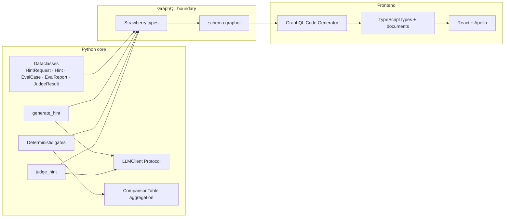

# NudgeMath Architecture

Contract-first stack: shapes are defined once in Python and propagated through every layer. No hand-written TypeScript mirrors of server types.

## Type propagation chain

**Provider abstraction:** `generate_hint` and `judge_hint` call `LLMClient.complete()` — not a vendor SDK directly. `OpenAICompatibleClient` targets Ollama, Anthropic's OpenAI-compatible endpoint, OpenRouter, Groq, etc. Model and provider are **config** (`ModelConfig` from env vars), surfaced in `Hint.meta` / `JudgeResult.meta` as typed GraphQL fields (`name`, `model`, `provider`).

**Comparison is an aggregation layer, not a reshape.** `EvalReport` remains the per-(case, model) atom — unchanged fields, unchanged `to_dict()`. `ComparisonTable` groups a flat `list[EvalReport]` into rows (cases) × columns (generation models) and computes aggregates. We rejected folding comparison fields into `EvalReport` because that would break the envelope contract and conflate the CI gate atom with cross-model analytics.

**Honest comparison signals (aggregation only):** Per-model aggregates include `judge_ok N/M` and `parse_fail K/M`, derived from `judge.meta.error` on each report — so a model that generates fine but produces malformed judge JSON is visible as judge unreliability, not misread as bad hint quality. Cross-model runs with `--judge` pin a neutral external judge (`PINNED_COMPARISON_JUDGE`, default `sonnet-4.6`) unless `LLM_JUDGE_*` overrides; the table header and self-judge flag both read from the same resolved judge config so they cannot disagree. Cells where generation `meta.model` equals the resolved judge model are flagged `*` with a footnote — self-judged scores are not comparable to externally judged ones. See [FIRST_EVAL.md](FIRST_EVAL.md) for the first live run that motivated separating self-report from deterministic gates.

**Source of truth:** Python dataclasses in `hint_engine/models.py` and `EvalReport.to_dict()` for the report envelope. GraphQL and TypeScript are derived — never the other way around.

---

## Structural boundaries (enforced + tested)

### 1. Answer-blind generation

| What | Detail |
|------|--------|
| **Rule** | `generate_hint(HintRequest)` never receives `correct_answer`. Production generation cannot leak an answer from an input field. |
| **GraphQL** | `HintRequestInput` and `HintType` have no `correctAnswer`. Introspection test fails CI if `correctAnswer` becomes reachable from the generation path. |
| **Frontend** | `GenerateHintMutation` type tree has no answer field — the compiler enforces the boundary in the browser. |
| **Test** | `tests/test_api.py::test_generation_path_has_no_correct_answer_field` |

### 2. Envelope agreement

| What | Detail |
|------|--------|
| **Rule** | `EvalReportType` mirrors `EvalReport.to_dict()` field-for-field (hint mirrored at report level as `hintText`, `revealsAnswer`, `meta`). |
| **No phantom fields** | No top-level `deterministicPassed` — use `deterministic { passed }`. |
| **Tests** | `test_eval_report_type_fields_match_to_dict_envelope`, SDL re-export diff in CI |
| **CI** | `schema` job diffs committed `schema.graphql` against `export_schema` output |

---

## Documented convention (not a structural lock)

**Eval/admin surface is answer-aware and unauthenticated in the demo.**

- `hints` query exposes `EvalCaseType.correctAnswer`.
- `evaluateCase` uses seed cases with known answers server-side.
- Anyone with the endpoint can query answers — acceptable for a portfolio demo with seed cases.
- **Production:** separate student generation API from eval/admin API behind auth.

This is stated explicitly in the README — a deliberate product boundary, not a silent gap.

---

## Evaluation model

### Two layers

| Layer | Role | CI |
|-------|------|-----|
| **Deterministic gates** | Hard invariants: literal leakage, banned phrases, length, empty hint, self-report flag | **Blocks build** |
| **LLM-judge** | Qualitative rubric: specificity, semantic leakage, tone, scaffolding | Never blocks CI (mocked offline) |

### Deterministic gates (five)

1. `does_not_reveal_answer` — normalized value + numeric/fraction regex (documented false positives)
2. `reveals_answer_flag` — model self-report must not claim leakage
3. `non_empty`
4. `within_max_length` (500 chars)
5. `no_banned_phrases`

### Judge rubric (four)

| Item | Must-pass? |
|------|------------|
| `addresses_specific_error` | Yes |
| `no_semantic_answer_leak` | Yes |
| `appropriate_for_level` | Advisory (affects score only) |
| `guides_without_solving` | Advisory |

### Two verdicts

- **`deterministic.passed`** — CI gate; reproducible; what pytest asserts.
- **`passed` (root)** — merged human-review verdict: `deterministic.passed AND (judge.passed if judge else True)`. Used in live `--judge` runs and the eval UI; not a CI blocker.

### Advisory signals (three layers)

1. **Model says** — `revealsAnswer` self-report on `HintType` / report mirror
2. **Text proves** — deterministic `does_not_reveal_answer` (ground truth for literals)
3. **Judge scores** — semantic leakage, pedagogical fit

**`flagDisagreement`** — model self-report diverges from text-leak check.

**`modelAnswerDisagreement`** — optional runner signal when model-derived answer disagrees with ground truth (advisory, not computed in v1 demo path by default).

---

## CI guards (offline by design)

All CI jobs run without `ANTHROPIC_API_KEY`. LLM generation and judge are mocked in tests.

| Job | Guard |
|-----|--------|
| **Python tests** | Deterministic gates, envelope test, answer-blind introspection, API mocks |
| **SDL drift** | Committed `schema.graphql` matches Strawberry export |
| **Frontend** | Codegen output committed; build + Vitest pass |

The **deterministic gate**, not the judge, blocks the build.

---

## Stack map

| Layer | Technology |
|-------|------------|
| Hint logic | Python 3.11, dataclasses, Anthropic SDK |
| Eval harness | `run_eval.py`, fixture-tested gates + optional `--judge` |
| API | Strawberry GraphQL 0.319, FastAPI 0.138, Uvicorn |
| Frontend | Vite 8, React 19, TypeScript, Tailwind 4, Apollo Client 4, GraphQL Code Generator 7 |

Types flow **schema → SDL → codegen → client** so the stack stays typed end to end.
