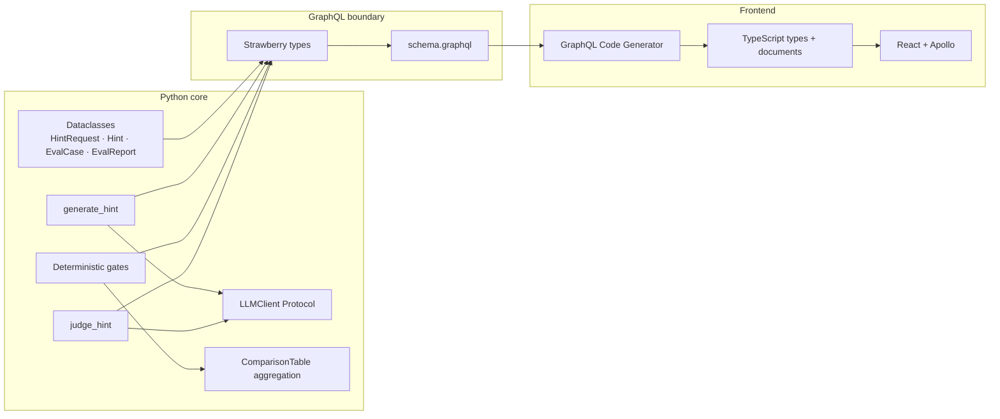

# NudgeMath Architecture

Contract-first stack: shapes are defined once in Python and propagated through every layer. No hand-written TypeScript mirrors of server types.

## Type propagation chain

```mermaid
flowchart LR
  subgraph python [Python core]
    DC[Dataclasses<br/>HintRequest · Hint · EvalCase · EvalReport]
    LLM[LLMClient Protocol]
    GEN[generate_hint]
    GATES[Deterministic gates]
    JUDGE[judge_hint]
    CMP[ComparisonTable aggregation]
  end

  subgraph api [GraphQL boundary]
    STRAW[Strawberry types]
    SDL[schema.graphql]
  end

  subgraph client [Frontend]
    CODEGEN[GraphQL Code Generator]
    TS[TypeScript types + documents]
    REACT[React + Apollo]
  end

  DC --> STRAW
  STRAW --> SDL
  SDL --> CODEGEN
  CODEGEN --> TS
  TS --> REACT
  GEN --> STRAW
  GATES --> STRAW
  JUDGE --> STRAW
  GEN --> LLM
  JUDGE --> LLM
  GATES --> CMP
```

**Provider abstraction:** `generate_hint` and `judge_hint` call `LLMClient.complete()` — not a vendor SDK directly. `OpenAICompatibleClient` targets Ollama, Anthropic's OpenAI-compatible endpoint, OpenRouter, Groq, etc.; `ClaudeSubscriptionClient` is a second implementation of the same Protocol that hits the native Anthropic Messages API with a **Claude-subscription OAuth bearer token** (no API key) — so a teacher can point generation at their own Claude plan from the Admin panel. Model and provider are **config** (`ModelConfig` from env vars), surfaced in `Hint.meta` / `JudgeResult.meta` as typed GraphQL fields (`name`, `model`, `provider`). Because both clients satisfy `complete(system, user)`, the subscription path is answer-blind by construction — swapping it in changes *which* model answers, nothing about what it sees.

**Comparison is an aggregation layer, not a reshape.** `EvalReport` remains the per-(case, model) atom — unchanged fields, unchanged `to_dict()`. `ComparisonTable` groups a flat `list[EvalReport]` into rows (cases) × columns (generation models) and computes aggregates. We rejected folding comparison fields into `EvalReport` because that would break the envelope contract and conflate the CI gate atom with cross-model analytics.

**Honest comparison signals (aggregation only):** Per-model aggregates include `judge_ok N/M` and `parse_fail K/M`, derived from `judge.meta.error` on each report — so a model that generates fine but produces malformed judge JSON is visible as judge unreliability, not misread as bad hint quality. Cross-model runs with `--judge` pin a neutral external judge (`PINNED_COMPARISON_JUDGE`, default `sonnet-4.6`) unless `LLM_JUDGE_*` overrides; the table header and self-judge flag both read from the same resolved judge config so they cannot disagree. Cells where generation `meta.model` equals the resolved judge model are flagged `*` with a footnote — self-judged scores are not comparable to externally judged ones. See [FIRST_EVAL.md](FIRST_EVAL.md) for the first live run that motivated separating self-report from deterministic gates.

**Source of truth:** Python dataclasses in `hint_engine/models.py` and `EvalReport.to_dict()` for the report envelope. GraphQL and TypeScript are derived — never the other way around.

---

## Structural boundaries (enforced + tested)

### 1. Answer-blind generation

| What | Detail |
|------|--------|
| **Rule** | `generate_hint(HintRequest)` never receives `correct_answer`. Production generation cannot leak an answer from an input field. |
| **GraphQL** | `HintRequestInput` and `HintType` have no `correctAnswer`. Introspection test fails CI if `correctAnswer` becomes reachable from the generation path. |
| **Frontend** | `GenerateHintMutation` type tree has no answer field — the compiler enforces the boundary in the browser. |
| **Test** | `tests/test_api.py::test_generation_path_has_no_correct_answer_on_output` |

### 1b. Front-stages that produce a `HintRequest`

Two input surfaces sit *in front of* generation. Each produces an ordinary `HintRequest` and leaves the answer-blind core untouched:

| Front-stage | What it does | Boundary |
|-------------|--------------|----------|
| **Image → text** (`transcribe.py`, `transcribeProblem`) | A `VisionClient` transcribes an uploaded photo/screenshot into `{ problem, studentAnswer }` — transcription only, never solving. | `TranscriptionType` has no answer field (test `test_transcription_type_has_no_correct_answer`). The extracted text flows into the unchanged `generateHint`. Math OCR is imperfect, so the UI makes the text editable before a hint is requested. |
| **Problem generation** (`problem_gen.py`, `generateProblem`) | Generates a grade-appropriate problem via a deterministic template (`arithmetic`, `linear_equations`, `quadratics`, `geometry` — exact answer, `verified=True`) or the LLM (`verified=False`). | The generator *knows* `correct_answer`, but it **never reaches the client**: the resolver stashes it in `api/problem_store.py` and returns only an opaque `problemId`. `GeneratedProblemType` has no answer field (test `test_generated_problem_type_has_no_answer_field`). A hint request carries the `problemId`; the server looks up the answer and gates correctness *before* the answer-blind hint (test `test_generate_hint_gates_correctness_via_problem_id`). The store is a `ProblemStore` Protocol with two backends chosen by env — in-memory (default, offline) or Redis (`REDIS_URL`, shared across workers with a TTL) — mirroring the provider-config pattern used for LLMs. |

The available topics come from the K-12 taxonomy in `data/curriculum.jsonl` (loaded by `curriculum.py`). The `curriculum(gradeLevel?)` query returns the band-scoped topic list, so the Practice topic picker is derived from the same Python source of truth rather than a hardcoded client list — contract-first all the way to the dropdown.

The vision path uses its own `VisionClient` Protocol (`vision_client.py`) and its own `LLM_VISION_*` config, separate from the text `LLMClient`, so the generation/judge path is never touched by multimodal concerns.

### 1c. Admin surface (auth-gated, additive)

An **admin** role sits *beside* the student flow, never inside it. A valid session token unlocks three capabilities and takes nothing from anonymous users:

| Capability | What it does | Boundary |
|------------|--------------|----------|
| **Reveal practice answer** (`revealAnswer(problemId)`) | Returns the answer already in `PROBLEM_STORE` for a generated Practice problem. | `RevealedAnswerType` requires the `IsAdmin` permission and is **not** in `GENERATION_ROOT_TYPES` — introspection-tested unreachable from the generation path (`test_reveal_answer_not_on_generation_path`). It reads a stored value; it never solves and never calls `generate_hint()`. Only Practice problems have a stored answer; transcribed/typed problems have none to reveal. |
| **Switch models** (`setModel(kind, preset)`) | Points the vision or generation model at a named preset for every request (in-memory, process-wide). Only **available** presets are offered/accepted — `list_available_model_presets` hides a model whose credential/connection is missing, and the resolver rejects an unavailable one. | Admin-only. `config.set_model_override` wins over env + default (`override › env › default`); no persistence, no secrets on disk. |
| **Generate solution** (`solveProblem(problem, gradeLevel?)`) | Produces a step-by-step worked solution + final answer with the separate **solver** model (`get_solver_config()`: override › `LLM_SOLVER_*` › provider default — independent of the generation selection). Teacher tooling: verify a model-authored problem, answer a photo problem with no stored answer. | Admin-only, and a *deliberate* solving path — unlike reveal it does solve, but `SolutionType` is **not** in `GENERATION_ROOT_TYPES` (introspection-tested, `test_solution_type_not_on_generation_path`), `solve_problem()` never calls `generate_hint()`, and the output never reaches the student flow or the `PROBLEM_STORE`. |
| **Connect Claude subscription** (`startClaudeLogin` / `finishClaudeLogin(code)` / `disconnectClaudeSubscription`, status via `claudeSubscription`) | In-app **PKCE OAuth** sign-in (`claude_oauth.py`): approve at claude.ai, paste the one-time `code#state`, and the token is stored server-side (gitignored `.nudgemath/`) and auto-refreshed. Once signed in, three Claude tiers (`claude-sonnet-5`, `claude-opus-4-8`, `claude-haiku-4-5`) become available generation/vision/solver presets (all multimodal; the vision path uses `ClaudeSubscriptionVisionClient` with an Anthropic base64 image block), and `setClaudeEffort` tunes `output_config.effort` for all subscription requests (never sent for Haiku, which rejects it). Disconnecting forgets the token and drops any generation/vision/solver override pointed at the subscription. | Admin-only. The OAuth/status types (`ClaudeSubscriptionStatusType`, `ClaudeLoginStartType`, `ClaudeLoginResultType`) are **not** in `GENERATION_ROOT_TYPES` and are introspection-tested unreachable from it (`test_claude_subscription_types_not_on_generation_path`). Connecting only chooses a provider; it never touches correctness gating or the answer store. Personal-use only (subscription tokens are gated to the Claude-Code identity). |

**Auth mechanics (stdlib only, no new deps).** Passwords are scrypt-hashed with a per-user salt (`auth.hash_password` / `verify_password`); accounts persist in a `UserStore` (file-backed by default at `NUDGEMATH_USERS_PATH`, gitignored) and are created via `python -m hint_engine.manage_users`. `login` returns an HMAC-signed bearer token (`create_token`); `app.get_context` verifies it into `admin_username`, which `IsAdmin` checks. Signing secret from `NUDGEMATH_AUTH_SECRET`. Same Protocol-swappable pattern as the LLM providers and `ProblemStore`.

### 1d. Public surface is bounded (the cost boundary)

Auth answers *who may do what*. It says nothing about *how much* an anonymous caller may spend — and every student-facing mutation is a paid model call, possibly on the operator's connected Claude subscription. So the public surface has a second, orthogonal boundary:

| Guard | Where | Bounds |
|---|---|---|
| Token-bucket rate limit | `rate_limit.py`, called first in each public resolver | Calls/minute per client (LLM mutations; `login`, the only unauthenticated scrypt path) |
| Input ceilings | `api/limits.py`, checked before any work | Image bytes, problem/answer/label lengths, `history` turns (each is replayed into the prompt, so an unbounded thread makes one request arbitrarily expensive) |
| Body-size guard | `api/app.py` middleware | `Content-Length` > `MAX_REQUEST_BYTES` → 413, before Starlette buffers the body |

Buckets are per-process and best-effort (N workers ⇒ N × the ceiling) — a spend ceiling, not an authorization boundary. `X-Forwarded-For` is trusted for the bucket key, which is only safe behind a reverse proxy; that trade is deliberate and documented at the call site. **New public resolvers must take `info` and rate-limit + size-cap before touching a model**; anything teacher-shaped belongs behind `IsAdmin` instead.

The same per-process caveat applies to `runtime_settings.SETTINGS` (the admin's model + effort overrides): the state is lock-guarded so concurrent resolvers can't corrupt it, but it is not shared *between* workers. Run a single worker, or move it behind Redis the way `ProblemStore` already is.

### 1e. API module layout

`api/schema.py` holds resolvers and schema assembly; `api/types.py` holds the Strawberry types, the dataclass→GraphQL converters, and `GENERATION_ROOT_TYPES` — the boundary list sits beside the types it names, rather than 300 lines below them. `api/context.py` isolates the two questions every resolver asks of a request (*who is calling* → `IsAdmin`; *which bucket pays* → `client_key`), and `api/limits.py` holds the input ceilings. The split is contract-preserving: the exported SDL is unchanged apart from one deliberate field reordering (public mutations grouped ahead of admin ones).

### 2. Envelope agreement

| What | Detail |
|------|--------|
| **Rule** | `EvalReportType` mirrors `EvalReport.to_dict()` field-for-field (hint mirrored at report level as `hintText`, `revealsAnswer`, `meta`). |
| **No phantom fields** | No top-level `deterministicPassed` — use `deterministic { passed }`. |
| **Tests** | `test_eval_report_type_fields_match_to_dict_envelope`, SDL re-export diff in CI |
| **CI** | `schema` job diffs committed `schema.graphql` against `export_schema` output |

---

## Documented convention (not a structural lock)

**Eval-seed surface is answer-aware and open in the demo.**

- `hints` query exposes `EvalCaseType.correctAnswer` — the curated seed dataset (fixture data, not student work).
- `evaluateCase` uses those seed cases with known answers server-side.
- Anyone with the endpoint can query seed answers — acceptable for a portfolio eval harness.
- **Now gated (§1c):** Practice-problem answers (`revealAnswer`), model switching (`setModel`), and the eval harness (`evaluateCase` — up to two LLM calls) require an admin login. The public mutations are rate-limited and size-capped instead (see §1d). **Remaining acceptance:** the `hints` query still returns seed-case `correctAnswer` (fixture data, not student work).

This is stated explicitly in the README — a deliberate product boundary, not a silent gap.

---

## Evaluation model

### Two layers

| Layer | Role | CI |
|-------|------|-----|
| **Deterministic gates** | Hard invariants: literal leakage, banned phrases, length, empty hint, self-report flag | **Blocks build** |
| **LLM-judge** | Qualitative rubric: specificity, semantic leakage, tone, scaffolding | Never blocks CI (mocked offline) |

### Deterministic gates (five)

1. `does_not_reveal_answer` — normalized value match; pure-digit answers use word boundaries and ignore positional phrases ("step 7" ≠ leak), tiny numbers 1–5 fall back to substring, plus fraction literals
2. `reveals_answer_flag` — model self-report must not claim leakage
3. `non_empty`
4. `within_max_length` (600 chars)
5. `no_banned_phrases`

A case may opt out of a specific gate via `expectations["skip_checks"]` (default: all five run); safety gates should not be skipped. Seed cases live in `hint_engine/data/eval_cases.jsonl` — the dataset grows as data, not code.

### Judge rubric (four)

| Item | Must-pass? |
|------|------------|
| `addresses_specific_error` | Yes |
| `no_semantic_answer_leak` | Yes |
| `appropriate_for_level` | Advisory (affects score only) |
| `guides_without_solving` | Advisory |

### Two verdicts

- **`deterministic.passed`** — CI gate; reproducible; what pytest asserts.
- **`passed` (root)** — merged human-review verdict: `deterministic.passed AND (judge.passed if judge else True)`. Used in live `--judge` runs and the eval UI; not a CI blocker.

### Advisory signals (three layers)

1. **Model says** — `revealsAnswer` self-report on `HintType` / report mirror
2. **Text proves** — deterministic `does_not_reveal_answer` (ground truth for literals)
3. **Judge scores** — semantic leakage, pedagogical fit

**`flagDisagreement`** — model self-report diverges from text-leak check.

**`modelAnswerDisagreement`** — optional runner signal when model-derived answer disagrees with ground truth (advisory, not computed in v1 demo path by default).

---

## CI guards (offline by design)

All CI jobs run without `ANTHROPIC_API_KEY`. LLM generation and judge are mocked in tests.

| Job | Guard | Run locally |
|-----|-------|-------------|
| **Ruff lint** | Python style + correctness (imports, unused, bugbear, pyupgrade) | `ruff check .` |
| **Python tests** | Deterministic gates, envelope test, answer-blind introspection, API mocks | `pytest -q` |
| **SDL drift** | Committed `schema.graphql` matches Strawberry export | `python -m hint_engine.api.export_schema` → `git diff schema.graphql` |
| **Frontend** | Codegen output committed; build + Vitest pass | `cd frontend ; npm run build ; npm test` |

The **deterministic gate**, not the judge, blocks the build.

---

## Stack map

| Layer | Technology |
|-------|------------|
| Hint logic | Python 3.11, dataclasses, Anthropic SDK |
| Eval harness | `run_eval.py`, fixture-tested gates + optional `--judge` |
| API | Strawberry GraphQL 0.319, FastAPI 0.138, Uvicorn |
| Frontend | Vite 8, React 19, TypeScript, Tailwind 4, Apollo Client 4, GraphQL Code Generator 7, KaTeX (math rendering) |

Types flow **schema → SDL → codegen → client** so the stack stays typed end to end.
